# Relink online and voice transport research

This note records the read-only investigation of the Windows Steam build of Granblue Fantasy: Relink 2.0.2. It is a technical feasibility result, not a statement that injecting a Mod or using a title's online services is authorized by Valve, Microsoft, Cygames, or the game's terms.

## Verified build

```text
granblue_fantasy_relink.exe
SHA-256 63340832bcf731fbc97796f686b05c988418e83d451d4a49b2244a85d00e297f
File/Product version 2.0.2

PartyWin.dll
SHA-256 3f0c6abbb735d81fa766a105982bda73f1d2c2cf01109fa2e7cf64813a52ce55
File version 1.10.2509.24002
Product version 1.10.12
```

The shipped `PartyWin.dll` is byte-for-byte identical to the x64 release DLL in Microsoft's official NuGet package `Microsoft.PlayFab.PlayFabParty.Cpp.Windows` version `1.10.12`: same 4,027,432-byte size, SHA-256, PE version and 157 named exports. The matching package supplies the exact `Party_c.h` ABI; no guessed structure layout or ordinal-only binding is required.

The Mod must still bind the game-shipped DLL in place. It must not replace or redistribute that DLL, and it must reject any unknown DLL hash or version.

## Reconstructed online stack

The executable directly imports Steam authentication, PlayFab Multiplayer Lobby and PlayFab Party APIs. The evidence supports this flow:

```mermaid
flowchart LR
    A["Steam user/session"] --> B["PFAuthenticationLoginWithSteam"]
    B --> C["PlayFab entity token"]
    C --> D["PlayFab Lobby create/find/join"]
    D --> E["Party network descriptor exchange"]
    E --> F["PartyCreateNewNetwork or PartyConnectToNetwork"]
    F --> G["PartyNetworkAuthenticateLocalUser"]
    G --> H["PartyNetworkCreateEndpoint"]
    H --> I["Relink gameplay/chat messages"]
```



Directly observed imports include:

- PlayFab Lobby: `PFMultiplayerCreateAndJoinLobby`, `PFMultiplayerFindLobbies`, `PFMultiplayerJoinLobby`, `PFLobbyGetConnectionString`, `PFLobbyGetLobbyId`, `PFLobbyGetLobbyProperty`, `PFLobbyGetMemberProperty`, `PFLobbyPostUpdate`, and `PFLobbyLeave`.
- Party network: `PartyCreateNewNetwork`, `PartySerializeNetworkDescriptor`, `PartyDeserializeNetworkDescriptor`, `PartyConnectToNetwork`, `PartyNetworkAuthenticateLocalUser`, `PartyNetworkCreateEndpoint`, `PartyEndpointSendMessage`, and leave/cleanup APIs.
- PlayFab authentication: `PFAuthenticationLoginWithSteamAsync` and Steam relogin APIs.

The executable also contains MSVC RTTI for `hw::network::GameNetworkPlayFab`, `NetworkUserPlayFab`, `LobbyPlayFab`, and `RecruitmentSearchPlayFab`. Microsoft documents the same integration pattern: serialize a Party network descriptor into PlayFab Lobby properties, then let guests deserialize it and connect to that Party network.

The exact Relink lobby-property key and individual call sites remain unverified. The executable's high-entropy `.bind` section prevents ordinary static IAT cross-references, so the descriptor handoff above is a strong import/RTTI/API inference that the lifecycle probe must confirm at runtime.

## Why this is not a Steam Lobby voice channel

The executable exposes Steam interface version strings for `SteamUser023`, `SteamFriends017`, `SteamInput006`, `SteamNetworkingUtils004`, `SteamUtils010` and several utility interfaces. No `SteamMatchmaking`, `SteamNetworkingMessages`, `SteamNetworkingSockets`, legacy P2P, or Steam Voice-specific interface string was found.

That negative result alone cannot prove a virtual interface is never requested, but it agrees with the direct PlayFab Lobby and Party evidence. Relink's game session should therefore not be modeled as a Steam Lobby with an implicit voice channel.

Steam Voice only captures/compresses and decompresses voice. The title must still enumerate peers and transmit those bytes itself. Using it here would require a second Steam peer topology plus a trustworthy PlayFab-entity-to-SteamID mapping that the current bridge does not expose.

## Party voice capability

The game imports only Party networking and endpoint APIs; it does not import any `PartyChatControl*` function. Voice is available in the exact shipped DLL but is not enabled by Relink's current call surface.

The verified C ABI includes:

```text
PartyDeviceCreateChatControl(device, localUser, languageCode, asyncId, out chatControl)
PartyNetworkConnectChatControl(network, chatControl, asyncId)
PartyChatControlSetAudioInput(chatControl, selectionType, context, asyncId)
PartyChatControlSetAudioOutput(chatControl, selectionType, context, asyncId)
PartyChatControlSetPermissions(local, remote, permissionFlags)
PartyChatControlSetAudioInputMuted(local, muted)
```

Party supplies capture, codec, authenticated transport and rendering. Chat permissions default to `None`; both peers must independently allow the send/receive relationship before audio flows. A push-to-talk implementation can keep the local input muted and unmute only while the configured key or controller button is held.

Every talking/listening client must have the Mod. Vanilla clients do not create a Party ChatControl and therefore cannot participate in the added voice layer. This must be treated as a Mod capability negotiation, not as voice that automatically reaches every lobby member.

## Route decision

| Route | Identity and transport | Protocol impact | Decision |
| --- | --- | --- | --- |
| Steam Voice + Steam NetworkingMessages | Requires a separate Steam peer session and PlayFab member to SteamID mapping | Separate from Relink, but duplicates session lifecycle | Feasible in principle, poor fit |
| Party ChatControl on the existing PartyNetwork | Reuses the authenticated PlayFab user, network and member lifecycle | Uses Party's dedicated chat plane; no custom game packet | Preferred |
| Steam Voice frames through `PartyEndpointSendMessage` | Reuses Party transport but invents a Mod packet protocol | Shares and can interfere with the gameplay endpoint | Reject for the first implementation |

WebRTC is unnecessary for the preferred route. It would add signaling, NAT/relay and a second identity/security boundary that the existing Party network already solves.

## Critical integration constraint

`PartyStartProcessingStateChanges` and `PartyFinishProcessingStateChanges` operate on the Party manager's shared state-change batch. The host game already drives this queue. A Mod-side loop must not call `StartProcessingStateChanges` independently because it could consume events before Relink sees them.

The safe design is one non-consuming observation layer:

1. Detour the game-shipped `PartyInitialize` export early and record the returned `PARTY_HANDLE` after the original succeeds.
2. Detour `PartyStartProcessingStateChanges`, call the original exactly once, inspect/copy only the event fields needed by the Mod, then return the original batch unchanged to Relink.
3. Detour `PartyFinishProcessingStateChanges` only to mark the observed batch complete; let the original retain all ownership and cleanup.
4. Invalidate all cached handles on `PartyCleanup`, local-user destruction, network leave and corresponding destroyed state changes.
5. Defer Mod actions outside the detour. Never make nested Party calls while Relink is processing an event batch.

This observation layer also avoids modifying Party endpoint payloads or Relink's matchmaking state.

## Staged validation

### Stage 1: lifecycle probe, no voice and no sends

- Gate on both verified EXE and `PartyWin.dll` hashes.
- Resolve named exports from the already loaded DLL; never call `PartyInitialize` a second time.
- Log initialize/cleanup, local user, create/connect/leave network, authentication, endpoint creation and state-change types.
- Query existing local users and networks only after the captured manager is ready.
- Confirm the inferred Lobby-to-Party lifecycle in a private two-client session.

### Stage 2: muted ChatControl canary

- Create one local ChatControl for the existing authenticated local user.
- Keep input muted before selecting system-default input/output.
- Connect it only to the already joined PartyNetwork.
- Observe local completion plus remote `ChatControlCreated`/`ChatControlJoinedNetwork` events.
- Do not grant audio permissions yet; verify join/leave and cleanup on both clients.

### Stage 3: push to talk

- Negotiate the Mod capability through ChatControl presence, not through gameplay endpoint packets.
- Grant only microphone send/receive permissions between Mod ChatControls.
- Keep the microphone muted by default; unmute while the configured push-to-talk control is held.
- Add per-player mute, input/output device selection, volume, disconnect cleanup and clear UI status.

## Safety and service boundary

- No STT model, transcript or GPU allocation is involved. Audio is handled by PlayFab Party and is not an offline-only feature.
- Never replace the game's Party DLL, initialize a second Party manager, alter the serialized network descriptor, create another gameplay endpoint, or feed custom voice packets to Relink's endpoint.
- Fail closed on unknown versions, missing exports, ambiguous lifecycle, unexpected state types or lost handle ownership.
- The NuGet package's license note says use requires an active PlayFab account and points to PlayFab service terms. A byte-identical shipped DLL proves ABI compatibility, not permission to extend the game's PlayFab title. Distribution and live-service authorization require separate review.

## Primary references

- [Microsoft: Party quickstart](https://learn.microsoft.com/en-us/gaming/playfab/multiplayer/networking/quickstart)
- [Microsoft: integrate Party with Lobby](https://learn.microsoft.com/en-us/gaming/playfab/multiplayer/networking/party-lobby-integration)
- [Microsoft: PartyLocalDevice::CreateChatControl](https://learn.microsoft.com/en-us/gaming/playfab/multiplayer/networking/reference/classes/partylocaldevice/methods/partylocaldevice_createchatcontrol)
- [Microsoft: PartyLocalChatControl::SetPermissions](https://learn.microsoft.com/en-us/xbox/playfab/multiplayer/networking/reference/classes/partylocalchatcontrol/methods/partylocalchatcontrol_setpermissions)
- [Microsoft: PartyLocalChatControl::SetAudioInput](https://learn.microsoft.com/en-us/gaming/playfab/multiplayer/networking/reference/classes/partylocalchatcontrol/methods/partylocalchatcontrol_setaudioinput)
- [Microsoft: PartyLocalChatControl::SetAudioInputMuted](https://learn.microsoft.com/en-us/gaming/playfab/multiplayer/networking/reference/classes/partylocalchatcontrol/methods/partylocalchatcontrol_setaudioinputmuted)
- [Valve: ISteamUser voice API](https://partner.steamgames.com/doc/api/isteamuser)
- [Valve: ISteamNetworkingMessages](https://partner.steamgames.com/doc/api/ISteamNetworkingMessages)
- [Official NuGet: Microsoft.PlayFab.PlayFabParty.Cpp.Windows 1.10.12](https://www.nuget.org/packages/Microsoft.PlayFab.PlayFabParty.Cpp.Windows/1.10.12)
