# Relink online and voice transport research

This note records the read-only investigation of the Windows Steam build of Granblue Fantasy: Relink 2.0.2. It is a technical feasibility result, not a statement that injecting a Mod or using a title's online services is authorized by Valve, Microsoft, Cygames, or the game's terms.

## Verified build

```text
granblue_fantasy_relink.exe
SHA-256 63340832bcf731fbc97796f686b05c988418e83d451d4a49b2244a85d00e297f
File/Product version 2.0.2

PartyWin.dll
SHA-256 3f0c6abbb735d81fa766a105982bda73f1d2c2cf01109fa2e7cf64813a52ce55
File version 1.10.2509.24002
Product version 1.10.12
```

The shipped `PartyWin.dll` is byte-for-byte identical to the x64 release DLL in Microsoft's official NuGet package `Microsoft.PlayFab.PlayFabParty.Cpp.Windows` version `1.10.12`: same 4,027,432-byte size, SHA-256, PE version and 157 named exports. The matching package supplies the exact `Party_c.h` ABI; no guessed structure layout or ordinal-only binding is required.

The Mod must still bind the game-shipped DLL in place. It must not replace or redistribute that DLL, and it must reject any unknown DLL hash or version.

## Reconstructed online stack

The executable directly imports Steam authentication, PlayFab Multiplayer Lobby and PlayFab Party APIs. The evidence supports this flow:

```mermaid
flowchart LR
    A["Steam user/session"] --> B["PFAuthenticationLoginWithSteam"]
    B --> C["PlayFab entity token"]
    C --> D["PlayFab Lobby create/find/join"]
    D --> E["Party network descriptor exchange"]
    E --> F["PartyCreateNewNetwork or PartyConnectToNetwork"]
    F --> G["PartyNetworkAuthenticateLocalUser"]
    G --> H["PartyNetworkCreateEndpoint"]
    H --> I["Relink gameplay/chat messages"]
```



Directly observed imports include:

- PlayFab Lobby: `PFMultiplayerCreateAndJoinLobby`, `PFMultiplayerFindLobbies`, `PFMultiplayerJoinLobby`, `PFLobbyGetConnectionString`, `PFLobbyGetLobbyId`, `PFLobbyGetLobbyProperty`, `PFLobbyGetMemberProperty`, `PFLobbyPostUpdate`, and `PFLobbyLeave`.
- Party network: `PartyCreateNewNetwork`, `PartySerializeNetworkDescriptor`, `PartyDeserializeNetworkDescriptor`, `PartyConnectToNetwork`, `PartyNetworkAuthenticateLocalUser`, `PartyNetworkCreateEndpoint`, `PartyEndpointSendMessage`, and leave/cleanup APIs.
- PlayFab authentication: `PFAuthenticationLoginWithSteamAsync` and Steam relogin APIs.

The executable also contains MSVC RTTI for `hw::network::GameNetworkPlayFab`, `NetworkUserPlayFab`, `LobbyPlayFab`, and `RecruitmentSearchPlayFab`. Microsoft documents the same integration pattern: serialize a Party network descriptor into PlayFab Lobby properties, then let guests deserialize it and connect to that Party network.

The exact Relink lobby-property key and individual call sites remain unverified. The executable's high-entropy `.bind` section prevents ordinary static IAT cross-references, so the descriptor handoff above is a strong import/RTTI/API inference that the lifecycle probe must confirm at runtime.

## Why this is not a Steam Lobby voice channel

The executable exposes Steam interface version strings for `SteamUser023`, `SteamFriends017`, `SteamInput006`, `SteamNetworkingUtils004`, `SteamUtils010` and several utility interfaces. No `SteamMatchmaking`, `SteamNetworkingMessages`, `SteamNetworkingSockets`, legacy P2P, or Steam Voice-specific interface string was found.

That negative result alone cannot prove a virtual interface is never requested, but it agrees with the direct PlayFab Lobby and Party evidence. Relink's game session should therefore not be modeled as a Steam Lobby with an implicit voice channel.

Steam Voice only captures/compresses and decompresses voice. The title must still enumerate peers and transmit those bytes itself. Using it here would require a second Steam peer topology plus a trustworthy PlayFab-entity-to-SteamID mapping that the current bridge does not expose.

## Party voice capability

The game imports Party networking and endpoint APIs plus `PartySetWorkMode`, but it imports neither `PartyDoWork` nor any `PartyChatControl*` function. Voice is available in the exact shipped DLL but is not enabled by Relink's current call surface. The static import pair is consistent with the title placing an unused task in manual mode without pumping it; the runtime `PartyGetWorkMode` log remains the authoritative check for each process.

The verified C ABI includes:

```text
PartyDeviceCreateChatControl(device, localUser, languageCode, asyncId, out chatControl)
PartyNetworkConnectChatControl(network, chatControl, asyncId)
PartyChatControlSetAudioInput(chatControl, selectionType, context, asyncId)
PartyChatControlSetAudioOutput(chatControl, selectionType, context, asyncId)
PartyChatControlSetPermissions(local, remote, permissionFlags)
PartyChatControlSetAudioInputMuted(local, muted)
```

Party supplies capture, codec, authenticated transport and rendering. Chat permissions default to `None`; both peers must independently allow the send/receive relationship before audio flows. A push-to-talk implementation can keep the local input muted and unmute only while the configured key or controller button is held.

Every intended talking/listening client must have the Mod. A remote `ChatControlJoinedNetwork` handle alone does not prove that the peer runs this Mod: the current Party event fields contain no Relink member slot, platform identity or Mod protocol marker. Production capability negotiation must therefore add an explicit authenticated Mod-to-Mod proof before granting permissions or showing a per-player voice badge; it must not assume that every same-network ChatControl belongs to this Mod.

## Route decision

| Route | Identity and transport | Protocol impact | Decision |
| --- | --- | --- | --- |
| Steam Voice + Steam NetworkingMessages | Requires a separate Steam peer session and PlayFab member to SteamID mapping | Separate from Relink, but duplicates session lifecycle | Feasible in principle, poor fit |
| Party ChatControl on the existing PartyNetwork | Reuses the authenticated PlayFab user, network and member lifecycle | Uses Party's dedicated chat plane; no custom game packet | Preferred |
| Steam Voice frames through `PartyEndpointSendMessage` | Reuses Party transport but invents a Mod packet protocol | Shares and can interfere with the gameplay endpoint | Reject for the first implementation |

WebRTC is unnecessary for the preferred route. It would add signaling, NAT/relay and a second identity/security boundary that the existing Party network already solves.

## Critical integration constraint

`PartyStartProcessingStateChanges` and `PartyFinishProcessingStateChanges` operate on the Party manager's shared state-change batch. The host game already drives this queue. A Mod-side loop must not call `StartProcessingStateChanges` independently because it could consume events before Relink sees them.

The safe design is one non-consuming observation layer:

1. Detour the game-shipped `PartyInitialize` export early and record the returned `PARTY_HANDLE` after the original succeeds.
2. Detour `PartyStartProcessingStateChanges`, call the original exactly once, inspect/copy only the event fields needed by the Mod, then return the original batch unchanged to Relink.
3. Detour `PartyFinishProcessingStateChanges` only to mark the observed batch complete; let the original retain all ownership and cleanup.
4. Invalidate all cached handles on `PartyCleanup`, local-user destruction, network leave and corresponding destroyed state changes.
5. Defer Mod actions outside the detour. Never make nested Party calls while Relink is processing an event batch.

This observation layer also avoids modifying Party endpoint payloads or Relink's matchmaking state.

## Staged validation

### Stage 1: lifecycle probe, no voice and no sends

The observation probe is implemented in `Native/PartyLifecycleProbe.cs` and enabled by default. Host and joining-client logs have confirmed manager capture, create/connect, authentication, endpoint and remote-device lifecycle ordering in a private session.

- Gate on both verified EXE and `PartyWin.dll` hashes.
- Resolve named exports from the already loaded DLL; never call `PartyInitialize` a second time.
- Log initialize/cleanup, local user, create/connect/leave network, authentication, endpoint creation and state-change types.
- Query existing local users and networks only after the captured manager is ready.
- Confirm the inferred Lobby-to-Party lifecycle in a private two-client session.

### Stage 2: muted ChatControl canary

- Implemented in `Native/PartyChatControlCanary.cs` and enabled by default. Two-client creation, connection, remote ChatControl discovery and pre-leave local teardown events have been confirmed on both host and guest.
- Create one local ChatControl for the existing authenticated local user.
- Keep input muted before selecting the configured input/output. Each side may independently use Party `SystemDefault` or `Manual` with a Windows Core Audio endpoint ID.
- Connect it only to the already joined PartyNetwork.
- Observe local completion plus remote `ChatControlCreated`/`ChatControlJoinedNetwork` events.
- The Stage 2 portion grants no audio permissions; it establishes and validates join/leave ownership before Stage 3 is allowed to run.
- Native work discovered from state changes is deferred until after the game's original `PartyFinishProcessingStateChanges` returns. The canary additionally detours Relink's existing `PartyNetworkLeaveNetwork` call: before entering the original function, it queues destruction of the still-muted local ChatControl so Party can return `ChatControlLeftNetwork`, destroy completion and destroyed events through Relink's normal state-change pump. It never starts or consumes a state-change batch itself.
- The canary never binds an endpoint-send export and rejects manager/session ambiguity, malformed batches, unknown state types, pre-existing local ChatControls and failed mute verification.

### Stage 3: push to talk

- The external voice test is implemented and enabled by default. Every intended participant must install the same package. The current test can observe remote ChatControl handles, but that observation is not yet a secure Mod capability proof and cannot map a handle to one of Relink's four HUD slots.
- Treat explicit Mod capability negotiation and remote ChatControl-to-Relink-slot correlation as required follow-up work. Do not label CPU, vanilla or merely same-network controls as verified Mod peers.
- The current test calls `PartyChatControlSetPermissions(local, remote, 0x0005)` for observed remote controls. The only enabled bits are `SendMicrophoneAudio` (`0x0001`) and `ReceiveMicrophoneAudio` (`0x0004`); text-to-speech, text-chat and transcription permissions remain unset. This test behavior must be tightened behind the explicit capability proof before a production release.
- Do not configure an audio-manipulation capture stream in the production path. Party's default ChatControl path owns microphone capture, encoding, transport and remote rendering. The earlier replacement sink filled its configured 200 ms buffer after five 40 ms frames and then returned `0x10D8` continuously because no consumer drained it; preview.11 removes that replacement path rather than resetting or enlarging the queue.
- After the existing manager is captured, preview.13 queries both Party work modes. If `Audio=Automatic`, Party's internal real-time audio thread remains the sole owner and the Mod does no work. If `Audio=Manual`, the Mod runs one dedicated above-normal-priority pump and calls only `PartyDoWork(manager, Audio)` at 40 ms intervals, as required by the official Party ABI. It never calls `PartySetWorkMode`, never pumps `Networking`, and synchronously stops the audio pump before suspend or `PartyCleanup`. An Audio-mode query or Audio `DoWork` error disables voice for that manager; the independent Networking-mode query is diagnostic only.
- Keep the Party microphone synchronously muted and verified by default. DirectInput consumes `U` for the voice test. A U hold only calls `PartyChatControlSetAudioInputMuted(false)` and verifies the readback; release calls the same API with `true`. No WASAPI capture backend, resampler, custom PCM buffer or `PartyAudioManipulationSinkStreamSubmitBuffer` call participates in online voice.
- A 350 ms input heartbeat watchdog forces release after focus loss, lost key-up or stalled keyboard polling. Mod suspend, remote-capability loss, pre-leave cleanup and terminal failure also force a best-effort mute before ChatControl destruction.
- Party permission, mute and setup calls are fenced while Relink owns a state-change batch and run only after the game's original `PartyFinishProcessingStateChanges` returns.
- Reloaded-II exposes independent dynamic lists for active Windows capture and render endpoints. Both lists default to an explicit `Default (Windows system default)` entry, which maps to the Windows default communications endpoint. Manual choices save the stable `IMMDevice` endpoint ID while the UI displays the friendly device name. Legacy blank values migrate to `Default`; a saved endpoint that is no longer active falls back to that default with an explicit startup log. The microphone choice drives Party's U input selection and the I monitor's local WASAPI capture; the playback choice drives Party's output route and I's local monitor route. Party `Manual` selection is accepted only when the completion event confirms the exact endpoint ID before the ChatControl can connect.
- The chat overlay has a persistent voice status row for session wait, ChatControl initialization, remote wait, ready, speaking, disconnect and fail-closed states. `Speaking` is derived from the lock-protected canary state only after `SetAudioInputMuted(false)` succeeds and `GetAudioInputMuted` verifies `false`; a raw `U` key-down is not sufficient.
- `0.4.0-preview.10` keeps the position-only party HUD microphone overlay and the live-memory-verified full HP-row battle anchors. Following the 2560x1440 in-game check, it renders the indicator at roughly 48 px and keeps its center 12 px to the right of the preview.6 position; other resolutions continue to follow the game's native HUD transform. It uses a strict native party-HUD whitelist instead of per-screen blacklists: an anchor is emitted only when the live `ControllerPlParameterTown`/`ControllerPlParameter01` visibility state at `+0x188` is nonzero and its selected HP-row node is active. Menus, results and every other screen without the party HP HUD therefore submit no foreground indicator draw commands. Its default debug override shows every live CPU or player HUD row so lobby and battle placement can be checked without peers. Placement follows the game's active `ControllerPlParameterTown`/`ControllerPlParameter01` child-node transforms and current viewport rather than screenshot coordinates or a reference-resolution scale; lobby/battle selection is automatic. Idle indicators retain 70% Alpha but use a muted palette; Speaking uses the bright 100% palette. With the override disabled, all per-slot icons remain hidden until explicit capability and identity mapping are implemented; the preview never guesses a remote slot from ChatControl timing or display name.
- Preview.11 retains the completely separate hold-`I` local microphone monitor. It opens the configured Windows capture and render endpoints in WASAPI shared mode, copies microphone samples only to the local playback device, and measures a local peak for UI/log evidence. Release closes a one-way silence gate without taking the audio-buffer lock; potentially blocking NAudio endpoint cleanup runs on a dedicated background thread and cannot delay a subsequent `I` hold. It never calls Party, changes chat permissions or sends audio over the network. `U` has priority, and both paths are fail-closed on release, focus loss, input timeout, suspend or endpoint failure.
- The Party troubleshooting sampler remains read-only. A complete online pass requires the speaking client to report `localIndicator=Talking` and the receiving client to report the same peer with permissions `0x0005`, incoming audio unmuted, positive render volume and `remoteIndicator=Talking`; evidence from different peers cannot be combined. See `VOICE_TROUBLESHOOTING_MATRIX.md`.
- Controller push-to-talk and per-player volume/mute remain future work.

## Safety and service boundary

- No STT model, transcript or GPU allocation is involved. Audio is handled by PlayFab Party and is not an offline-only feature.
- Never replace the game's Party DLL, initialize a second Party manager, alter the serialized network descriptor, create another gameplay endpoint, or feed custom voice packets to Relink's endpoint.
- Fail closed on unknown versions, missing exports, ambiguous lifecycle, unexpected state types or lost handle ownership.
- The NuGet package's license note says use requires an active PlayFab account and points to PlayFab service terms. A byte-identical shipped DLL proves ABI compatibility, not permission to extend the game's PlayFab title. Distribution and live-service authorization require separate review.

## Primary references

- [Microsoft: Party quickstart](https://learn.microsoft.com/en-us/gaming/playfab/multiplayer/networking/quickstart)
- [Microsoft: integrate Party with Lobby](https://learn.microsoft.com/en-us/gaming/playfab/multiplayer/networking/party-lobby-integration)
- [Microsoft: PartyLocalDevice::CreateChatControl](https://learn.microsoft.com/en-us/gaming/playfab/multiplayer/networking/reference/classes/partylocaldevice/methods/partylocaldevice_createchatcontrol)
- [Microsoft: PartyLocalChatControl::SetPermissions](https://learn.microsoft.com/en-us/xbox/playfab/multiplayer/networking/reference/classes/partylocalchatcontrol/methods/partylocalchatcontrol_setpermissions)
- [Microsoft: PartyLocalChatControl::SetAudioInput](https://learn.microsoft.com/en-us/gaming/playfab/multiplayer/networking/reference/classes/partylocalchatcontrol/methods/partylocalchatcontrol_setaudioinput)
- [Microsoft: PartyLocalChatControl::SetAudioInputMuted](https://learn.microsoft.com/en-us/gaming/playfab/multiplayer/networking/reference/classes/partylocalchatcontrol/methods/partylocalchatcontrol_setaudioinputmuted)
- [Microsoft: real-time audio manipulation](https://learn.microsoft.com/en-us/xbox/playfab/community/voice-communications/concepts-realtime-audio-manipulation)
- [Microsoft: PartyLocalChatControl::ConfigureAudioManipulationCaptureStream](https://learn.microsoft.com/en-us/xbox/playfab/multiplayer/networking/reference/classes/partylocalchatcontrol/methods/partylocalchatcontrol_configureaudiomanipulationcapturestream)
- [Microsoft: PartyAudioManipulationSinkStream::SubmitBuffer](https://learn.microsoft.com/en-us/gaming/playfab/multiplayer/networking/reference/classes/partyaudiomanipulationsinkstream/methods/partyaudiomanipulationsinkstream_submitbuffer)
- [Microsoft: troubleshoot Party audio and chat](https://learn.microsoft.com/en-us/xbox/playfab/community/voice-communications/concepts-audio-troubleshooting)
- [Microsoft: PartyManager::SetWorkMode](https://learn.microsoft.com/en-us/gaming/playfab/multiplayer/networking/reference/classes/partymanager/methods/partymanager_setworkmode)
- [Microsoft: PartyManager::DoWork](https://learn.microsoft.com/en-us/gaming/playfab/multiplayer/networking/reference/classes/partymanager/methods/partymanager_dowork)
- [Microsoft: PartyLocalChatControl::GetChatIndicator](https://learn.microsoft.com/en-us/gaming/playfab/multiplayer/networking/reference/classes/partylocalchatcontrol/methods/partylocalchatcontrol_getchatindicator)
- [Valve: ISteamUser voice API](https://partner.steamgames.com/doc/api/isteamuser)
- [Valve: ISteamNetworkingMessages](https://partner.steamgames.com/doc/api/ISteamNetworkingMessages)
- [Official NuGet: Microsoft.PlayFab.PlayFabParty.Cpp.Windows 1.10.12](https://www.nuget.org/packages/Microsoft.PlayFab.PlayFabParty.Cpp.Windows/1.10.12)
