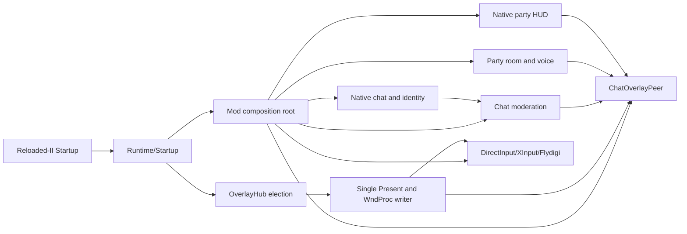

# System Overview

## Process model

GBFR Chat Overlay runs inside `granblue_fantasy_relink.exe` as a Reloaded-II mod. Its managed runtime composes four native-facing boundaries:

- Relink executable hooks for text chat, player identity, lobby owner, and native party-HUD controllers.
- PlayFab Party exports for online-room observation and Party voice.
- A native DirectInput/XInput bridge for physical input snapshots and input suppression.
- A native DXGI bridge plus Reloaded.Imgui.Hook for the shared Present/WndProc graphics writer.

## Composition root

`Runtime/Startup.cs` owns Reloaded-II interfaces, configuration loading, OverlayHub election, and graphics-host recovery. It constructs one `Mod` with a `Runtime/ModContext` containing only the dependencies the runtime consumes.

`Mod.cs` creates modules in dependency order:

1. Create the chat-moderation service and initialize the optional Steamworks text filter.
2. Resolve the current Relink chat manager context when hooks are available.
3. Resolve configured audio endpoints when Party voice is enabled.
4. Attach Party lifecycle hooks, which provide the authoritative online-room gate.
5. Attach native party-HUD factory/destructor hooks.
6. Create the local audio settings/self-test controller.
7. Attach native text, identity, and receive-moderation hooks.
8. Construct `ChatSession` and `ChatOverlayPeer`.
9. Register the peer with the process-local OverlayHub.
10. If this mod owns the OverlayHub host lease, activate the DirectInput carrier on the shared Present tick.

## Major data flows

### Incoming text

`Relink rpcMessage hook -> sender key resolver -> coherent member/local slots -> PlayFab identity -> raw-text decoder -> moderation decision -> original or rewritten Relink packet -> same final text queued to ChatSession -> ChatHistory -> overlay render`

### Outgoing text

`chat/custom action -> ChatSession -> Relink send function -> immediate authoritative-local queue entry -> later RPC echo reconciliation/deduplication`

### Party voice

`Party state-change observation -> existing manager/network/local user/device -> local ChatControl -> remote ChatControl reconciliation -> microphone permissions -> physical PTT edge/heartbeat -> Party native mute state`

### Voice indicators

`Party ChatControl EntityId/talking snapshot + coherent Relink four-member EntityId snapshot + native HUD anchors -> remote-player mapping -> fail-closed placement -> foreground microphone drawing`

## Ownership boundaries

- **Relink:** owns chat manager, native communication actions, player tables, UI controllers, and gameplay lifecycle.
- **PlayFab Party:** owns network, local user, endpoints, ChatControls, microphone capture, encoding, transport, and playback.
- **OverlayHub host:** owns the only ImGui context, Present hook, WndProc handler, and process-wide input-capture transition.
- **Chat Overlay peer:** owns chat/voice presentation, settings UI, hotkey intent, and its OverlayHub registration.

## Fail-closed policy

The code deliberately retains defensive checks at native ownership boundaries:

- Machine-code patterns and relative targets must match before hooks activate.
- Party calls never overlap Relink's active `StartProcessingStateChanges` batch.
- Identity snapshots are published only when manager pointer, bank selector, local key, and resolved slot remain coherent across the read.
- Voice icons require a valid voice snapshot, valid HUD anchors, one local row, and an unambiguous remote-player mapping.
- Input release uses physical edges plus a heartbeat watchdog; focus loss or a missing heartbeat forces Party input muted.
- Present and WndProc exceptions are contained so the original game path remains callable.

These checks are production safety boundaries. They protect native ownership, identity coherence, privacy, and the game's original rendering and input paths.
